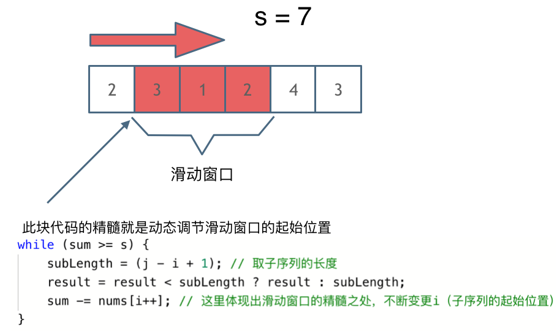

## 滑动窗口    Sliding Window

**核心思想：不断的调整子序列的起始位置和终止位置，从而得到想要的结果。**

实现滑动窗口，要确定三点：

* 窗口内是什么？
* 如何移动窗口的起始位置？
* 如何移动窗口的结束位置？

> 比较双指针：双指针方法需要确定两个指针指向的含义

> 滑动窗口解决的问题的特点：**连续序列，若不连续则无法滑动“一个”窗口**

在209.求长度最小的子数组问题中，

* 窗口：窗口内元素的和大于等于target值得长度最小的连续子数组；
* 起始位置如何移动：当窗口内元素和满足条件时，起始位置前移（缩小窗口）
* 结束位置如何移动：通过for循环遍历，每一次后移一位

**滑动窗口的精妙之处：根据当前子序列和大小的情况，不断调节子序列的起始位置，从而将时间复杂度降为O(N)**
