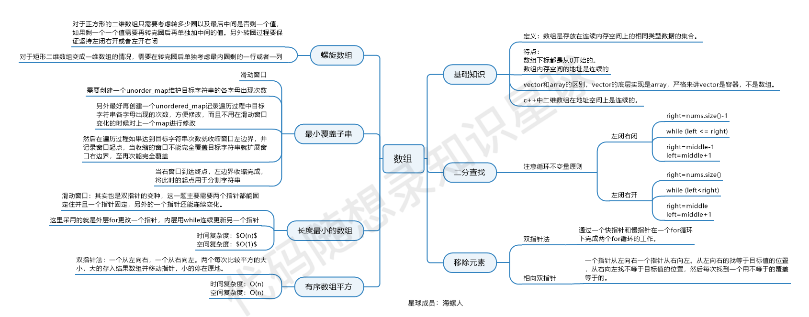

数组是存放在连续内存空间上的相同类型数据的集合。

因此，在删除或者增加元素时，不可避免地会移动其它元素的地址。

* 二分法
* 双指针法
* 滑动窗口
* 模拟行为

时间复杂度并不是说算法运行所需要多少时间，而是相对于输入数据规模，算法运行需要进行多少次的基本操作。

衡量一个算法的快慢，一定要考虑数据规模的大小。所谓数据规模，一般指输入的数字个数、输入中给出的图的点数与边数等等。一般来说，数据规模越大，算法的用时就越长。而在算法竞赛中，我们衡量一个算法的效率时，最重要的不是看它在某个数据规模下的用时，而是看它的用时随数据规模而增长的趋势，即  **时间复杂度** 。
